# Pokémon Explorer

A micro-frontend app for browsing Pokémon and berries from [PokéAPI](https://pokeapi.co), built as three Next.js zones in one Yarn monorepo.

**Live demo:** <https://pokemon-explorer-mode.vercel.app>

> On the demo, adding and deleting custom entries is turned off because serverless storage is read-only (`CUSTOM_STORAGE_READONLY=true`). [Run it locally](#getting-started) to try that feature.

## Screenshots

| Home | Pokémon list |
| --- | --- |
| 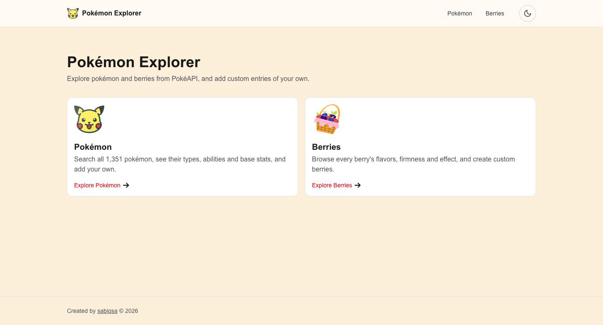 | 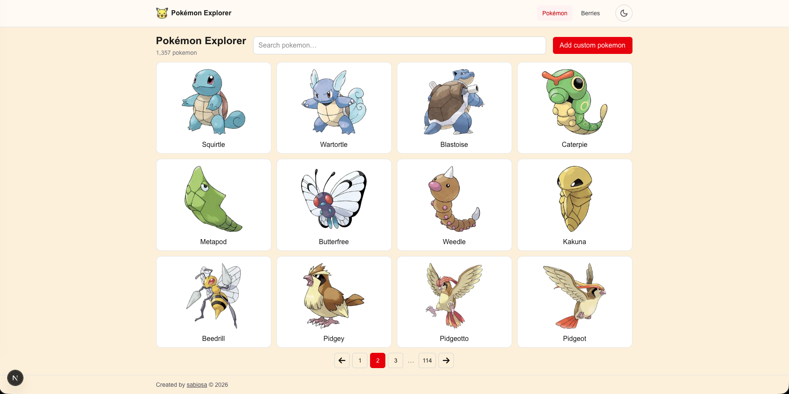 |
| **Pokémon search** | **Search with no results** |
| 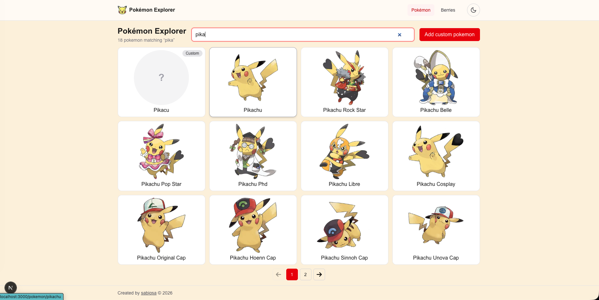 | 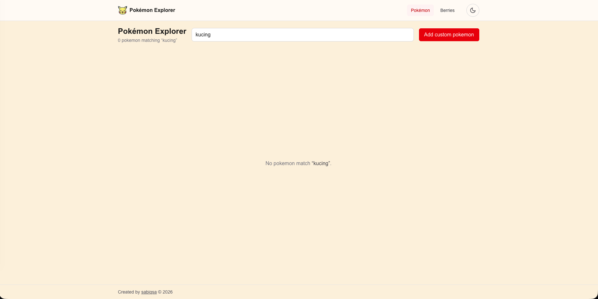 |
| **Pokémon detail** | **Berries list** |
| 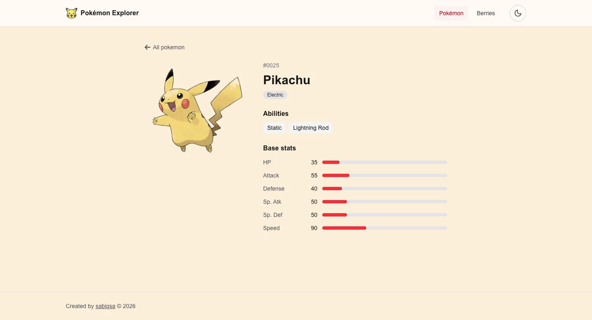 | 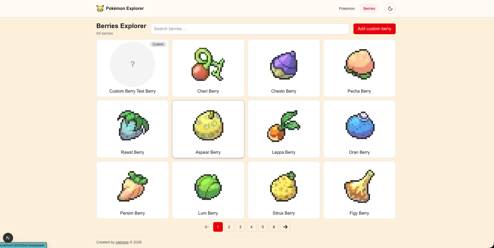 |
| **Berries search** | **Berry detail** |
| 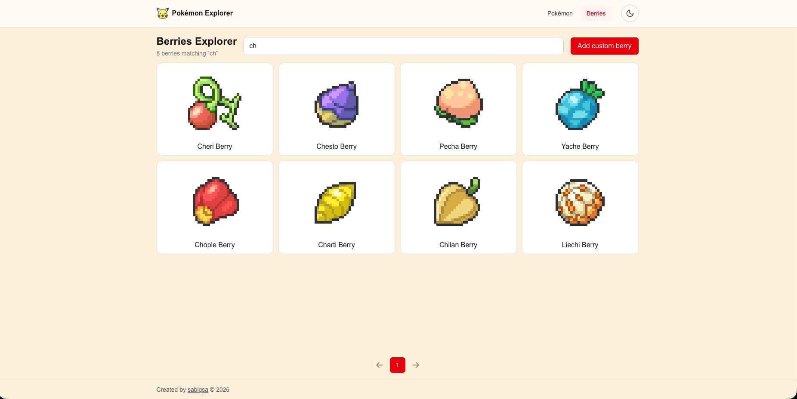 | 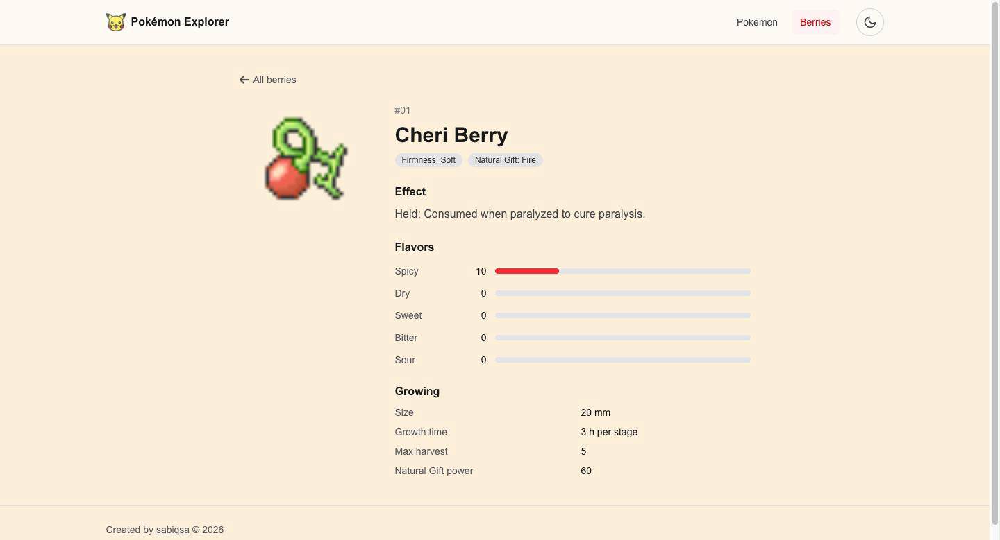 |
| **Add form (read-only on the demo)** | **Mobile list** |
| 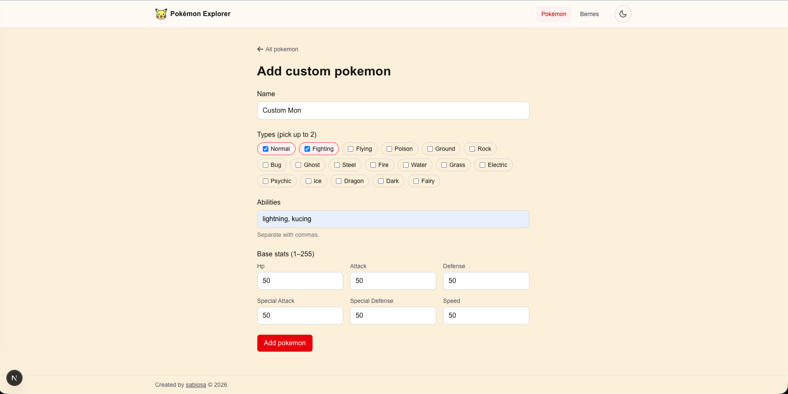 | 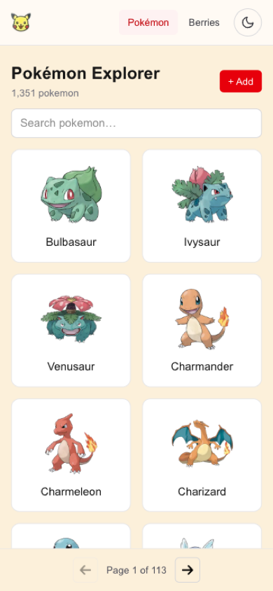 |

## Features

| Zone | What you can do |
| --- | --- |
| **Pokémon** | List, search and paginate every entry from `/pokemon`; detail page with types, abilities and base stats; add and delete custom Pokémon. |
| **Berries** | List, search and paginate all berries; detail page with firmness, flavors, effect and growth info; add and delete custom berries. |

Shared across both: navbar, light/dark theme, loading skeletons and image placeholders, and a no-scroll grid on large screens.

## Tech stack

| Tool | Version |
| --- | --- |
| Next.js (App Router, Cache Components) | 16.4.0 |
| React | 19.3.0 |
| TypeScript | 5 |
| Tailwind CSS | 4 |
| Vitest | 5 |
| Testing Library (React) + happy-dom | 16 / 20 |
| Yarn workspaces | 1.22.22 |

## Getting started

**Prerequisites:** Node.js 22.12+ or 24+ (required by Vitest 5; Next.js 16 alone needs 20.9+) and Yarn 1.22.

```bash
yarn install

# one env file per app
cp apps/host/.env.example apps/host/.env.local
cp apps/pokemon/.env.example apps/pokemon/.env.local
cp apps/berries/.env.example apps/berries/.env.local

yarn dev
```

Then open **<http://localhost:3000>**. `yarn dev` starts all three apps; the host forwards `/pokemon` and `/berries` to the zones.

| App | Port | basePath | Local URL |
| --- | --- | --- | --- |
| host | 3000 | none | <http://localhost:3000> |
| pokemon | 3002 | `/pokemon` | <http://localhost:3002/pokemon> |
| berries | 3001 | `/berries` | <http://localhost:3001/berries> |

The `.env.example` defaults work locally as-is. Custom entries are saved to `apps/<zone>/data/*.json` (git-ignored, created on first save).

## Scripts

Run from the repo root:

| Command | What it does |
| --- | --- |
| `yarn dev` | Runs host, pokemon and berries together (`concurrently`). |
| `yarn typecheck` | Type-checks every workspace (`apps/*` run `next typegen` first, so it works on a fresh clone). |
| `yarn lint` | ESLint for every app. |
| `yarn test` | Runs every unit test once (Vitest). |
| `yarn test:watch` | Vitest in watch mode. |
| `yarn build` | Production build of host, pokemon and berries. `packages/*` are source-only and get compiled by the apps. |

For a single workspace: `yarn workspace <name> <script>` (e.g. `yarn workspace pokemon lint`), or `yarn vitest run --project <pokemon|berries|packages|dom>` for its tests.

## Architecture

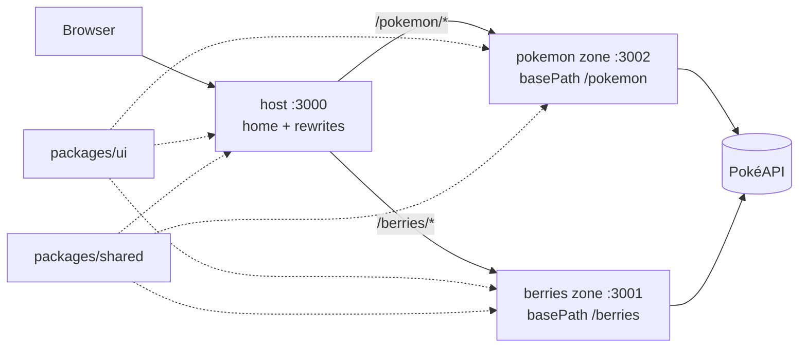

```
apps/
  host/       home page, rewrites to the zones (next.config.ts)
  pokemon/    Pokémon zone (basePath /pokemon)
  berries/    Berries zone (basePath /berries)
packages/
  ui/         shared components: Navbar, Footer, Card, CatalogLayout, Pagination, SearchInput, ...
  shared/     shared types, pure utils and client hooks
```

Each zone keeps its feature code in `src/features/<zone>/`, and its data layer follows the same order:

| Layer | Path | Role |
| --- | --- | --- |
| api | `data/api/pokeapi.ts` | Raw PokéAPI calls, with `"use cache"` on the list and lookup endpoints. |
| mappers | `data/mappers/` | Pure functions that turn API shapes into domain types. |
| repository | `data/repository/` | Storage for custom entries behind an interface (JSON file implementation). |
| services | `data/services/` | Merge API and custom data, search, paginate and validate; pages and actions only call this layer. |
| actions | `data/actions/` | Server Actions for add/delete: server-side checks, storage call, `updateTag`. |
| components | `components/` | Zone-specific UI (forms, stat/flavor bars) built on `packages/ui`. |

## Requirement mapping

| Key technical point | Where and how |
| --- | --- |
| **Microfrontend** | Next.js multi-zones: `apps/host/next.config.ts` rewrites `/pokemon` and `/berries` to separate apps, each with its own `basePath` (`apps/pokemon/next.config.ts`, `apps/berries/next.config.ts`). |
| **Server-side fetching** | Pages are Server Components that call services, e.g. `apps/pokemon/src/app/page.tsx` → `features/pokemon/data/services/pokemon-service.ts` → `data/api/pokeapi.ts`. |
| **Server actions** | `features/*/data/actions/create-*.ts` and `delete-*.ts`, used by `PokemonForm`/`BerryForm` and `packages/ui/src/ConfirmDeleteButton`. |
| **Caching** | `"use cache"` + `cacheLife` + `cacheTag` in `data/api/pokeapi.ts` and `data/services/*-service.ts`; `updateTag` in the actions. See [Caching](#caching). |
| **Custom hooks** | `packages/shared/src/hooks/useDebounce.ts`, `useUpdateSearchParams.ts`, used by `packages/ui/src/SearchInput`. |
| **Separation of concerns** | Layered data folders per zone (table above); generic code in `packages/`, domain code stays in each zone. |
| **Responsive** | Tailwind breakpoints plus a custom `fit-screen` variant (`apps/*/src/app/globals.css`) used by `packages/ui/src/CatalogLayout`. |
| **Documentation** | This README and a short README per app (`apps/*/README.md`). |
| **Unit tests** | Vitest projects in `vitest.config.mts`: logic tests run in Node, hook and component tests (Testing Library) run in happy-dom. See [Testing](#testing). |
| **No ready-made UI components** | All components in `packages/ui/src/` are hand-written with Tailwind; no component library is installed. |

## Key decisions

- **Multi-zones instead of Module Federation.** Zones are plain Next.js apps joined by rewrites, so each keeps the App Router, Server Components and Server Actions, and can build and deploy on its own. Module Federation does not support the App Router well and couples runtime bundles.
- **Search without a search endpoint.** PokéAPI has no search, so each zone caches the full name list (one request), then filters and paginates on the server. Query and page live in the URL (`?q=&page=`), so results are shareable and work with back/forward.
- **No N+1 on the list.** Card images are built from data the list already has: Pokémon artwork from the ID, berry sprites from the name. A list page makes one PokéAPI request (covered by `berry-service.test.ts`).
- **Custom entries without an endpoint.** A repository interface with a JSON-file implementation stores them; the service merges them with API data (custom first). IDs start with `custom-` so they never clash with PokéAPI IDs, and only those can be deleted.
- **Shared packages stay generic.** `packages/ui` and `packages/shared` hold components, types, pagination and text helpers. Mappers, services, validation and cache tags stay in each zone.
- **Page size and layout.** 12 items per page (`PAGE_SIZE` in `packages/shared`). On screens at least 1024×800 the list is a 4×3 grid that fits one screen without scrolling; smaller screens use a normal scrolling grid with sticky pagination on mobile.

### Caching

| Data | `cacheLife` | Tag |
| --- | --- | --- |
| Pokémon name list | `weeks` | `pokemon-list` |
| Pokémon detail (mapped) | `weeks` | `pokemon:<name>` |
| Pokémon types | `max` | `pokemon-types` |
| Custom Pokémon | `max` | `custom-pokemon` |
| Berry name list | `weeks` | `berry-list` |
| Berry detail (berry + item, mapped) | `weeks` | `berry:<name>` |
| Berry firmness list | `max` | `berry-firmness` |
| Custom berries | `max` | `custom-berries` |

Details are cached after mapping, not as raw responses (a raw Pokémon or berry item response is far larger than the fields the UI needs). Add and delete call `updateTag` on the custom tag, so the list and detail pages show the change immediately.

## Trade-offs and known limitations

- **Hard navigation between zones.** Links across zones use plain `<a>`, so moving between Pokémon and Berries is a full page load.
- **Zones are meant to be reached through the host.** Navbar links are built from `NEXT_PUBLIC_HOST_URL`, so they still point to the host when a zone is opened on its own domain.
- **Not-found returns HTTP 200.** `notFound()` runs inside `<Suspense>` while the page streams, so the "not found" UI renders but the status code is already 200.
- **JSON storage does not work on serverless.** The demo sets `CUSTOM_STORAGE_READONLY=true` to disable writes with a clear message. For production, swap the repository implementation for a database or KV store; services and actions stay the same.
- **The Pokémon list mirrors `/pokemon` as is,** including alternate forms. Entries without official artwork show a fallback.
- **Berry list sprites are built from the name** (`<name>-berry.png`); any berry whose sprite doesn't exist shows a fallback.
- **Server Actions have no auth** (out of scope). They still validate input on the server, and delete only accepts `custom-` entries that exist.

## Deployment

Three Vercel projects from this repo, one per app, with **Root Directory** set to `apps/host`, `apps/pokemon` and `apps/berries`.

| Env | host | pokemon | berries |
| --- | --- | --- | --- |
| `POKEMON_URL` | pokemon project URL | | |
| `BERRIES_URL` | berries project URL | | |
| `NEXT_PUBLIC_HOST_URL` | host URL (optional) | host URL | host URL |
| `CUSTOM_STORAGE_READONLY` | | `true` | `true` |

Env values are read at build time (rewrites, `NEXT_PUBLIC_*` inlining, the prerendered `/new` page), so set them before deploying and redeploy after changing them.

## Testing

```bash
yarn test
```

160 tests in 22 files, all passing. They cover:

- **Mappers:** PokéAPI → domain types, including missing data (`data/mappers/*.test.ts`).
- **Search and pagination:** query normalization, filtering, page slicing (`data/services/search.test.ts`, `packages/shared/src/utils/pagination.test.ts`, `page-items.test.ts`).
- **Validation:** add-form rules (`data/services/validate.test.ts`).
- **Repository:** JSON storage create/list/delete, missing file, read-only folder (`data/repository/*.test.ts`).
- **Actions:** read-only rejection and error messages (`data/actions/*-actions.test.ts`).
- **Service:** the berry list makes exactly one PokéAPI request (`berry-service.test.ts`).
- **Shared utils:** storage errors, host URLs, search params, text helpers (`packages/shared/src/utils/*.test.ts`).
- **Hooks:** `useDebounce` with fake timers, `useUpdateSearchParams` with a mocked router (`packages/shared/src/hooks/*.test.ts`).
- **Components:** `Pagination` ellipses, `aria-current`, disabled Previous/Next and links that keep `q` (`packages/ui/src/Pagination/Pagination.test.tsx`).

Logic tests run in Node; hook and component tests run in a separate `dom` project with happy-dom (`vitest.config.mts`).

## Future improvements

- Persistent storage (Postgres or a KV store) behind the existing repository interface, so add/delete works on the deploy.
- End-to-end tests (e.g. Playwright) for search, pagination and the add/delete flow through the host.
- More component tests (forms, search input, delete dialog).
- A real 404 status for unknown names, by resolving the name before the page streams.

## Credits

- Data: [PokéAPI](https://pokeapi.co).
- Pokémon artwork and item sprites: [PokeAPI/sprites](https://github.com/PokeAPI/sprites).
- Theme toggle icons: `moon` from [Feather](https://feathericons.com) (MIT) and `sun` from [Lucide](https://lucide.dev) (ISC), inlined as SVG.
- Icons from [Flaticon](https://www.flaticon.com):

| Icon | Used for | Author | Source |
| --- | --- | --- | --- |
| Pikachu (`pikachu.png`) | Navbar logo in every zone, Pokémon card on the home page | Those Icons | [flaticon.com/free-icon/pikachu_528098](https://www.flaticon.com/free-icon/pikachu_528098) |
| Pokeball (`pokeball.png`) | Favicon and Apple touch icon (`apps/*/src/app/icon.png`, `apple-icon.png`) | Those Icons | [flaticon.com/free-icon/pokeball_528101](https://www.flaticon.com/free-icon/pokeball_528101) |
| Arrow (`arrow.png`) | Back links, pagination Previous/Next, "Explore" links on the home page | Kirill Kazachek | [flaticon.com/free-icon/arrow_507257](https://www.flaticon.com/free-icon/arrow_507257) |
| Basket (`berries.png`) | Berries card on the home page | Retro cartoon | [flaticon.com/free-sticker/basket_14746805](https://www.flaticon.com/free-sticker/basket_14746805) |

Icon files live in `packages/ui/src/Assets/`.
